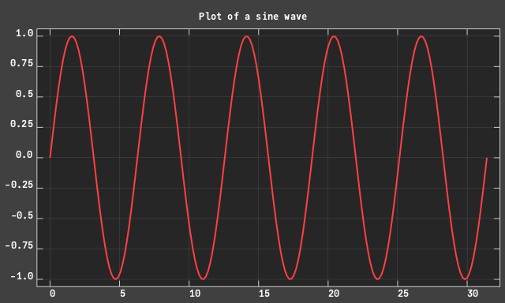

# CairoPlot

Simple plot tool based on [JuliaGraphics/Cairo.jl](https://github.com/JuliaGraphics/Cairo.jl), which itself is an adaptation (binding) to Julia of the [Cairo](https://github.com/JuliaGraphics/Cairo.jl) C library.

The aim here is to have a plotting tool with minimal dependencies and fast.

It is still a work in progress and it is a not a registered package yet.

Ops, I just found out that there is already the package [JuliaGraphics/Winston.jl](https://github.com/JuliaGraphics/Winston.jl) that does that. 🤦‍♂️

Ok, I might continue with the project anyway, mostly as an exercise, but no point in registering it, thought.

The package can be added with

```julia
pkg> add https://github.com/rmsrosa/CairoPlot.jl
```

Example:

```julia
julia> using Cairo

julia> using CairoPlot

julia> Nx = 640
640

julia> Ny = 384
384

julia> title = "Plot of a sine wave"

julia> x = range(0, 10π, length=200)
0.0:0.1578689775673263:31.41592653589793

julia> y = sin.(x)
200-element Vector{Float64}:
  0.0
  0.15721404296725078
  ⋮
 -1.2246467991473533e-15

julia> xticks = 0:5:30
0:5:30

julia> yticks = -1.0:0.25:1.0
-1.0:0.25:1.0

julia> c = crplot(x, y; xticks, yticks, Nx, Ny, title)
Cairo.CairoSurfaceBase{UInt32}(Ptr{Nothing} @0x00007fa5e866a0e0, 640.0, 384.0)

julia> write_to_png(c,"cairoplot_sinexample.png")
0
```


