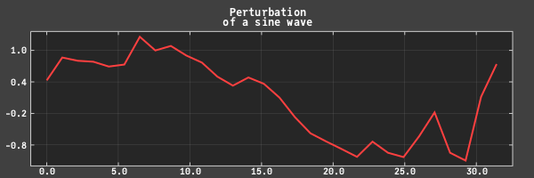
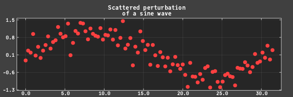

# CairoPlot

Simple plot tool based on [JuliaGraphics/Cairo.jl](https://github.com/JuliaGraphics/Cairo.jl), which itself is an adaptation (binding) to Julia of the [Cairo](https://github.com/JuliaGraphics/Cairo.jl) C library.

The aim here is to have a plotting tool with minimal dependencies and fast.

It is still a work in progress and it is a not a registered package yet.

Ops, I just found out that there is already the package [JuliaGraphics/Winston.jl](https://github.com/JuliaGraphics/Winston.jl) that does that. 🤦‍♂️

Ok, I might continue with the project anyway, mostly as an exercise, but no point in registering it, thought.

The package can be added with

```julia
pkg> add https://github.com/rmsrosa/CairoPlot.jl
```

## Examples

```julia
x = range(0, 10π, length=200)
y = sin.(x)
xticks = 0:5:30
yticks = -1.0:0.25:1.0
c = crplot(x, y; xticks, yticks, title = "Plot of a sine wave")
write_to_png(c,"sineplot.png")
```


```julia
x = range(0, 10π, length=30)
y = sin.(x/5) .+ 0.3randn(length(x))
c = crplot(x, y; Nx = 600, Ny = 200, title = "Perturbation\n of a sine wave")
write_to_png(c,"perturbedsineplot.png")
```



```julia
title = "Scattered perturbation\n of a sine wave"
x = range(0, 10π, length=100)
y = sin.(x/5) .+ 0.3randn(length(x))
c = crplot(x, y; plotstyle = :scatterplot, Nx = 600, Ny = 200,
    title = "Scattered perturbation\n of a sine wave")
write_to_png(c,"scatteredperturbedsineplot.png")
```



```julia
xd = today():Year(1):today()+Year(20)
yd = rand(length(xd))
c = crplot(xd, yd; title="Prediction for the next 20 years")
write_to_png(c,"20years_future.png")
```


```julia
xd = today()-Month(1):Day(1):today()
yd = 100.0 * rand(length(xd))
c = crplot(xd, yd; xticks = 5, yticks = 10, title="One month evolution")
write_to_png(c,"onemonth_past.png")
```


